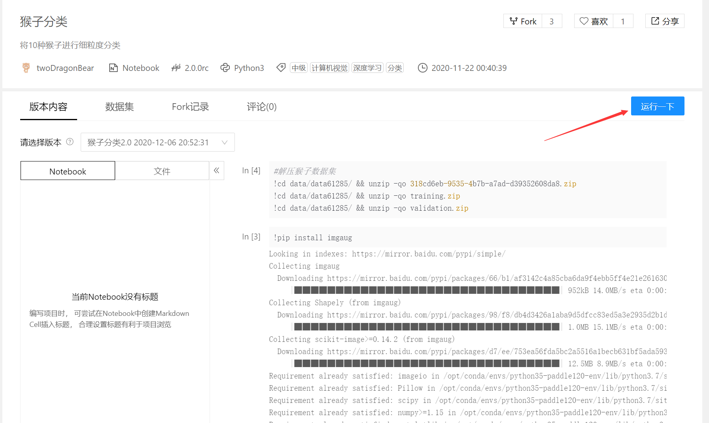

# README

## 1.简介

项目地址：https://aistudio.baidu.com/aistudio/projectdetail/1250975

数据集地址：https://www.datafountain.cn/datasets/102

## 2.参数说明(aistudio高级版)：

- GPU: Tesla V100. 
- Video Mem: 16GB
- CPU: 4 Cores. 
- RAM: 32GB. 
- Disk: 100GB
- 注意：训练有时候会显示jupty已重启，这多半是显存爆了，需要重启环境。

## 3.依赖库

- imgaug

其他库在aistudio环境中都已经存在

**安装代码**

```py
!pip install imgaug
```

## 4.使用说明

1. 点击运行一下

   

2. 按照顺序依次执行代码(训练需要较长时间)

3. 得到相应的运行结果

